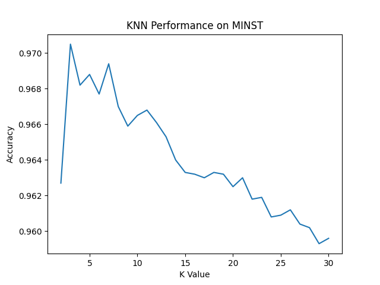

---
puppeteer:
    format: "A4"
    scale: 0.75
    margin:
        top: 1cm
        right: 1cm
        bottom: 1cm
        left: 1cm
---

# KNN-Digital-Recognition

Author: HuRuilizhen
Repository: [github.com/HuRuilizhen/knn-digital-recognition](https://github.com/HuRuilizhen/knn-digital-recognition)

---  
  
This project is for 2023 CSC3001 Final Project: Using one of machine learning method to do digital recognition

the reports will be divided into several parts, including  

1. **Introducing the Problem of Handwritten Digit Recognition**
2. **Commands and Operations to Reproduce the Project**
3. **Presenting Code Implementation**
4. **Presenting the Overall Results, and Analyzing Results**
5. **Conclusion with a Summary of Findings**

---

## Introducing the Problem of Handwritten Digit Recognition

Handwritten digit recognition is an important problem in the field of computer vision and machine learning, whose goal is to automatically recognize human-written numbers from images.

Mainstream approaches include the following:
1. **Input**: Picture of handwritten numbers.
2. **Preprocessing**: Adjusting and cleaning images.
3. **Feature extraction**: Find the key information in the picture.
4. **Classifier design**: Use machine learning algorithms to build a model that recognizes numbers. 

The data set used in this project is the MINST data set, and the machine learning method adopted is KNN. The detailed description will be expanded in the following part.

The significance of studying handwritten digit recognition is mainly reflected in the following aspects:
- Office automation: In institutions such as banking, tax, postal, etc., where a lot of handwritten forms need to be processed, automatic recognition can improve efficiency and reduce errors.
- Educational application: Used to evaluate students' math work to help teachers save time and provide personalized feedback.
- Accessibility technology: Assisted reading services are provided to the visually impaired to enhance their ability to live independently.
- Research platform: As a basic research topic of pattern recognition and machine learning, handwritten digit recognition helps to promote the theoretical and technical development of related fields.
- Human-computer interaction: On mobile devices and touch screens, handwritten digit recognition can provide an intuitive and natural means of user input.

---

## Commands and Operations to Reproduce the Project

### Project Structure

```tree
DIGITAL RECOGNITION
|
│  README.md
│
├─code
│  │  makefile                      * IMPORTANT TO REPRODUCE THE PROJECT
│  │  train                         Created after run make commands
│  │
│  └─ModelTrainer                   Code Repo
│          DataLoader.cpp           
│          DataLoader.h             Loading the image set, label set and Parsing data
│          DataSaver.cpp
│          DataSaver.h              Saving the model and performance with different parameter
│          DataTester.cpp
│          DataTester.h             Testing the data to find the accuracy
│          DataTrainer.cpp
│          DataTrainer.h            Training the knn model through given data sets
│          main.cpp
│
├─data                              Data Sets of MINST
│      t10k-images.idx3-ubyte
│      t10k-labels.idx1-ubyte
│      train-images.idx3-ubyte
│      train-labels.idx1-ubyte
│
├─model                             KNN model after training
│      minst.xml
│
├─recode                            Record of Different Model Storage
│      performance.csv
│      performance.png
│      performance.py
│
└─report
```

## Operations to Reproduce

In order for the project to generate an executable file, you need to change the opencv-related directory in the **code/makefile**.

makefile in my machine is like:
```makefile
OPENCV_INCLUDE := D:\opencv\opencv-4.8.0\build\install\include

OPENCV_BIN := D:\opencv\opencv-4.8.0\build\install\x64\mingw\bin

main: main.cpp DataLoader.cpp DataTrainer.cpp DataTester.cpp DataSaver.cpp
	g++ -g -o main main.cpp DataLoader.cpp DataTrainer.cpp DataTester.cpp DataSaver.cpp -I ${OPENCV_INCLUDE} -L ${OPENCV_BIN} -l opencv_world480
```

Edit the value of **OPENCV_INCLUDE** and **OPENCV_BIN** to indicate the corresponding path.

Finish that, just run command **make** at **code/** in command line, the executable file **train** should be generate under **code/**.

If the version of opencv does not match the version used by the project, you also need to modify the **opencv_world** dependency to specify the corresponding version.

---

## Presenting Code Implementation

```cpp
int main(int argc, char const *argv[])
{
    /*
        Loading data sets
    */
    cv::Mat trainImageMat = imageLoader(trainImageSet);
    cv::Mat trainLabelMat = labelLoader(trainLabelSet);
    cv::Mat testImageMat = imageLoader(testIamgeSet);
    cv::Mat testLabelMat = labelLoader(testLabelSet);

    /*
        Training the data and Saving the different performance with k values
    */
    cv::Ptr<cv::ml::KNearest> bestKnn;
    double bestAccuracyRate = 0;

    for (int k = 1; k <= 30; k++)
    {
        cv::Ptr<cv::ml::KNearest> knn = modelKnnTrainer(k, trainImageMat, trainLabelMat);
        double currentAccuracyRate = modelPredictTester(knn, testImageMat, testLabelMat);
        modelDataRecoder(k, currentAccuracyRate);
        if (bestAccuracyRate < currentAccuracyRate)
        {
            bestAccuracyRate = currentAccuracyRate;
            bestKnn = knn;
        }
    }

    /*
        Saving the knn value with the best performance in the default set
    */
    modelDataSaver(bestKnn);

    return 0;
}

```

The main function shows the main steps in the procedure. For details, check other cpp files. Codes with well written comments are provided in the cpp files. 
- **DataLoader.cpp** contains functions to parse the data, load image set or label set in the MINST. 
- **DataTrainer.cpp** contains functions to train the model, this part mainly used apis of opencv 
- **DataTester.cpp** contains functions to test the output of the model with testing dataset in the MINST. 
- **DataSaver.cpp** contains functions to save the model and record the performance.

--- 

## Presenting the Overall Results, and Analyzing Results

The csv file in recode folder records the performance of KNN model's accuracy rate under different K values. In general, the influence of K value on the accuracy rate tends to rise first and then decline. This change is well illustrated in the chart below:



It can be noted that the optimal k value of the KNN model in this test data set is 3, and the corresponding accuracy rate is **0.9705**. Therefore, the KNN model is not only simple to realize, but also has a good performance in handwritten data recognition.

---

## Conclusion with a Summary of Findings

KNN algorithm recognizes handwritten digits by stretching the two-dimensional image of handwritten digits into a one-dimensional vector, and marking the corresponding vector of the image of the training set with the result label. When the recognition is carried out, the K vectors closest to the given image in the vector space under the Euclidean distance will be counted, and the recognition result will be the label that appears most among these K labels. Obviously, the size of the training set will affect the speed of recognition. Too large a data set will make the recognition time too long, and too small a data set will reduce the accuracy.

### Shortage and Improvement

When identifying, if no optimization is added, it will traverse all the vectors of the training set to select the nearest point pair. You can use a data structure such as a **K-D Tree** or **Ball Tree** to speed up the search process. The two data structures are integrated in opencv's knn model and can be called directly.

When calculating the result, the nearest K vector labels can be **weighted** to calculate the final result. The closer the vector is, the greater the contribution value of the corresponding label. The improvement can improve the recognition results to a certain extent without significant time consumption. This method is also integrated into opencv's knn model.

The recognition accuracy of KNN model will decrease obviously after rotation and scaling of test image. Misjudgments can be reduced by expanding the training data set. **Adding rotated and scaled images** to the original training dataset can bring optimization to the model.
